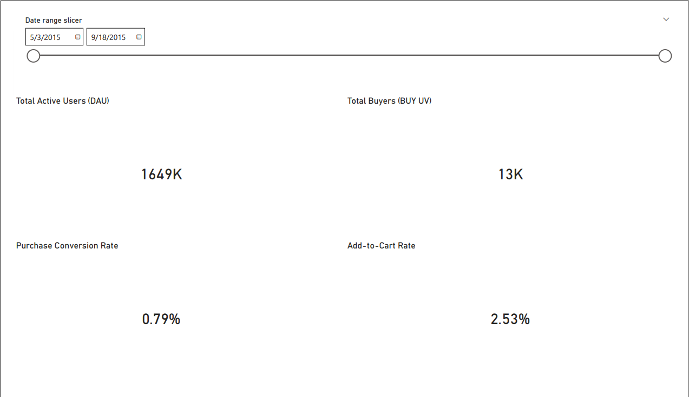
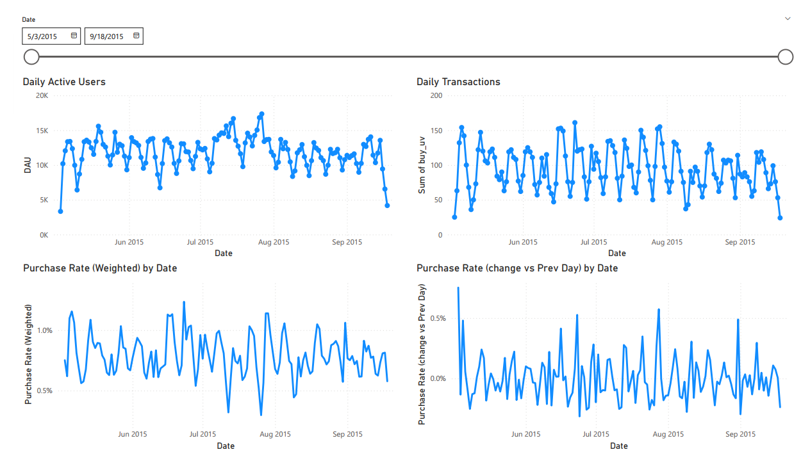
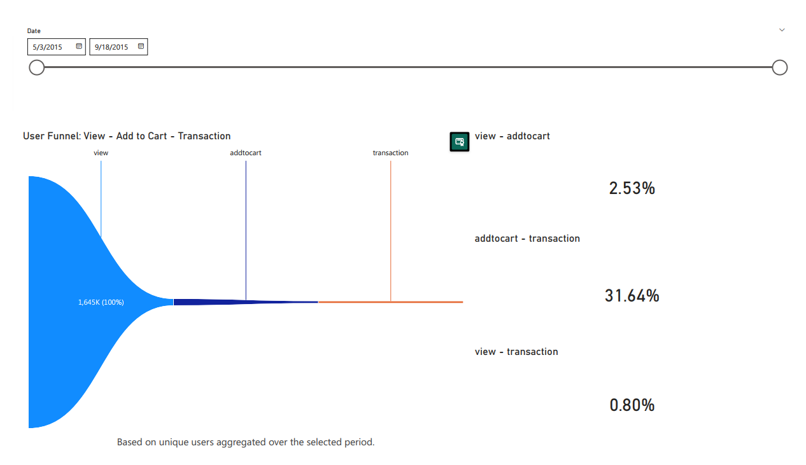
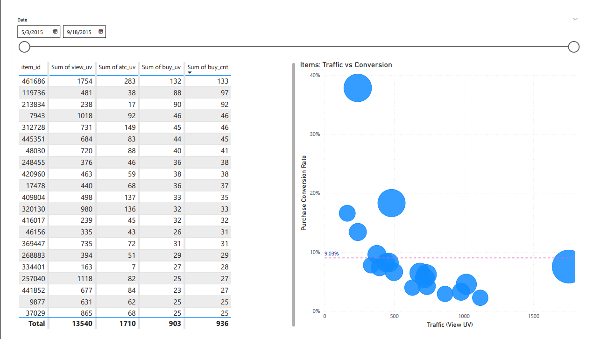
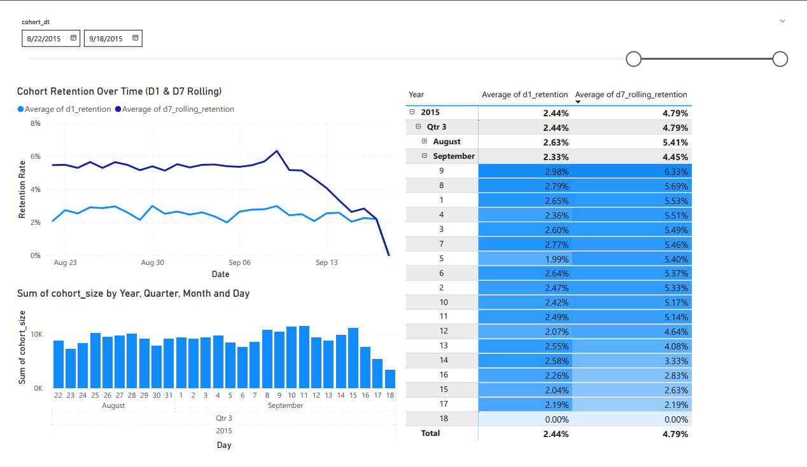

# 电商增长分析项目（Spark + Power BI）

👉 [English Version](README_EN.md)

本项目基于电商用户行为日志数据，使用 **PySpark** 构建指标层，
并通过 **Power BI** 对用户规模、转化漏斗、商品表现和留存情况进行可视化分析，
用于支持增长分析与业务决策。

---

## 一、数据与处理流程

- **原始数据**：Retail Rocket 电商用户事件日志  
- **处理环境**：WSL2 + PySpark  
- **分析粒度**：日级（Daily）

构建的核心指标包括：
- 日活跃用户（DAU）
- 浏览 → 加购 → 成交 转化漏斗
- 商品级转化分析
- 基于 Cohort 的用户留存（D1 / D7 Rolling）
- 所有指标均通过 **日期切片器（Date Slicer）** 动态计算，支持按任意时间区间进行对比分析。

---

## 二、Figure A：整体增长概览（Overview）

**核心指标**
- 活跃用户数（DAU）
- 成交用户数（Buy UV）
- 成交转化率（Purchase Rate）
- 加购转化率（Add-to-Cart Rate）

该部分用于快速判断在选定时间窗口内的**用户规模与转化效率**。

---

## 三、Figure B：趋势分析（Trends）

通过时间序列展示：
- DAU 随时间变化趋势
- 成交转化率随时间变化趋势

用于区分增长变化是由**流量规模**还是**转化效率**驱动。

---

## 四、Figure C：用户转化漏斗（Funnel）

展示用户从：
**浏览 → 加购 → 成交** 的转化结构，
用于识别用户流失最严重的关键环节。

---

## 五、Figure D：商品级增长机会分析（Top Items）

通过商品级散点图：
- 横轴：浏览用户数（流量）
- 纵轴：成交转化率
- 点大小：成交用户规模

用于识别：
- **高流量但低转化**的优化对象  
- **高转化但低曝光**的潜在放量商品

---

## 六、Figure E：Cohort 留存分析（Retention）

基于用户首次活跃日期构建 Cohort，
计算：
- D1 留存率
- D7 Rolling 留存率（7 日内任意回访）

用于评估不同时间段用户质量的变化。

---

## 七、技术栈

- PySpark / Spark SQL
- Power BI
- Python
- WSL2（Linux 环境）

---

## 八、项目总结

- 将增长分析拆解为 **规模、效率、结构、抓手、留存**
- 使用 Spark 构建可复用的指标层
- 使用 BI 工具将分析结果转化为可决策的信息

